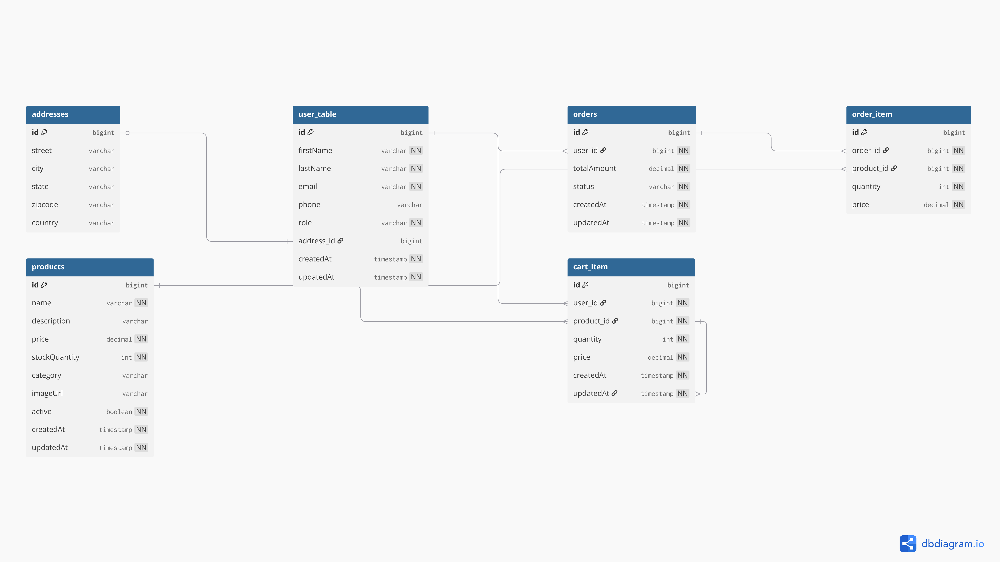
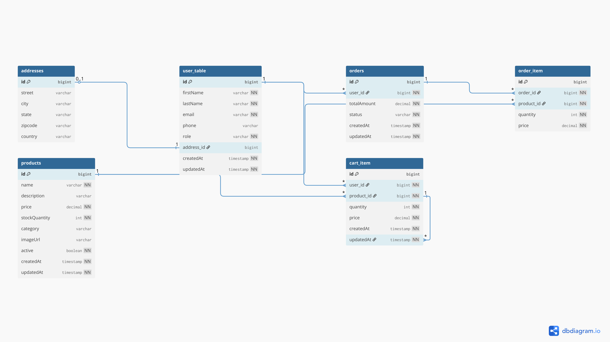

# 🛒 EcomUI — Full Stack E-Commerce Platform

A full-stack e-commerce application built with **Spring Boot** (backend REST API) and **React + Vite** (frontend SPA), backed by a **PostgreSQL** relational database managed via **Spring Data JPA / Hibernate**.

---

## 📋 Table of Contents

- [Overview](#overview)
- [Tech Stack](#tech-stack)
- [Project Structure](#project-structure)
- [Features](#features)
- [Database Design](#database-design)
  - [Entity-Relationship Diagram](#entity-relationship-diagram)
  - [Tables & Columns](#tables--columns)
  - [Relationships](#relationships)
  - [Key Database Concepts Used](#key-database-concepts-used)
- [API Reference](#api-reference)
- [Getting Started](#getting-started)
- [Docker Setup & Container Networking](#-docker-setup--container-networking)


---

## Overview

EcomUI is a multi-page e-commerce application where customers can browse products, manage a shopping cart, and place orders. Admins can manage the product catalogue through a dedicated admin panel, including creating, updating, and soft-deleting products.

---

## Tech Stack

| Layer      | Technology                                      |
|------------|-------------------------------------------------|
| Frontend   | React 19, React Router v7, Axios, Vite 8        |
| Backend    | Spring Boot 3, Spring Data JPA, Hibernate       |
| Database   | PostgreSQL                                      |
| ORM        | Hibernate (via Spring Data JPA)                 |
| Build Tool | Maven                                           |
| Runtime    | Java 21                                         |

---

## Project Structure

```
Ecom-UI/
├── ecom-application/          # Spring Boot backend
│   └── src/main/java/com/app/ecom/
│       ├── controller/        # REST controllers (HTTP layer)
│       ├── service/           # Business logic layer
│       ├── repository/        # Spring Data JPA repositories
│       ├── model/             # JPA entity classes (maps to DB tables)
│       └── dto/               # Request/Response DTOs
│
└── ecom-frontend/             # React + Vite frontend
    └── src/
        ├── api/               # Axios API service layer
        ├── context/           # React Context (CartContext)
        ├── pages/             # Page components (Shop, Admin, Cart, Users)
        └── components/        # Reusable components (ProductCard, Navbar)
```

---

## Features

- 🛍️ **Shop Page** — Browse active products with search & filter
- 🛒 **Cart** — Add/remove products; persistent cart per user (via `X-User-ID` header)
- ✅ **Checkout / Orders** — Place an order which converts cart items into order records
- 🧑‍💼 **Admin Panel** — Create, edit, and soft-delete products
- 👥 **Users Page** — Create and manage user accounts
- 🔍 **Product Search** — Case-insensitive keyword search (JPQL query)
- 🗑️ **Soft Delete** — Products are deactivated (`active = false`) rather than permanently removed

---

## Database Design

This section is the core of the application. The database is a **normalized PostgreSQL** schema with **6 tables** managed via Hibernate's `ddl-auto=update`.

### Entity-Relationship Diagram

> 📄 [Download full ER Diagram PDF](docs/ER_scheme.pdf)

**Page 1**



**Page 2**



---

### Tables & Columns

#### `addresses`
Stores shipping/billing address information for users.

| Column    | Type        | Constraints | Description             |
|-----------|-------------|-------------|-------------------------|
| `id`      | BIGINT      | PK, AUTO    | Primary key             |
| `street`  | VARCHAR     |             | Street address          |
| `city`    | VARCHAR     |             | City name               |
| `state`   | VARCHAR     |             | State/Province          |
| `zipcode` | VARCHAR     |             | Postal/ZIP code         |
| `country` | VARCHAR     |             | Country                 |

---

#### `user_table`
Stores customer and admin user accounts.

| Column       | Type        | Constraints     | Description                              |
|--------------|-------------|-----------------|------------------------------------------|
| `id`         | BIGINT      | PK, AUTO        | Primary key                              |
| `firstName`  | VARCHAR     |                 | User's first name                        |
| `lastName`   | VARCHAR     |                 | User's last name                         |
| `email`      | VARCHAR     |                 | Email address                            |
| `phone`      | VARCHAR     |                 | Phone number                             |
| `role`       | VARCHAR     | DEFAULT customer| Enum: `CUSTOMER`, `ADMIN`                |
| `address_id` | BIGINT      | FK → addresses  | One-to-one linked address (nullable)     |
| `createdAt`  | TIMESTAMP   | AUTO            | Audit: row creation time                 |
| `updatedAt`  | TIMESTAMP   | AUTO            | Audit: last modification time            |

---

#### `products`
The product catalogue. Supports **soft delete** via the `active` flag.

| Column          | Type      | Constraints  | Description                                    |
|-----------------|-----------|--------------|------------------------------------------------|
| `id`            | BIGINT    | PK, AUTO     | Primary key                                    |
| `name`          | VARCHAR   |              | Product name                                   |
| `description`   | VARCHAR   |              | Product description                            |
| `price`         | DECIMAL   |              | Unit price                                     |
| `stockQuantity` | INT       |              | Available stock count                          |
| `category`      | VARCHAR   |              | Product category tag                           |
| `imageUrl`      | VARCHAR   |              | URL or relative path to product image          |
| `active`        | BOOLEAN   | DEFAULT true | **Soft delete flag** — `false` = deleted       |
| `createdAt`     | TIMESTAMP | AUTO         | Audit: row creation time                       |
| `updatedAt`     | TIMESTAMP | AUTO         | Audit: last modification time                  |

> **Soft Delete:** When a product is "deleted" from the Admin panel, the backend sets `active = false` rather than issuing a `DELETE` SQL statement. All product queries filter by `WHERE active = true`, so deleted products disappear from the shop but remain in the database for historical integrity (e.g., past orders still reference them).

---

#### `cart_item`
Represents items a user has added to their shopping cart. Acts as a **junction / bridge table** between `user_table` and `products`.

| Column       | Type      | Constraints      | Description                       |
|--------------|-----------|------------------|-----------------------------------|
| `id`         | BIGINT    | PK, AUTO         | Primary key                       |
| `user_id`    | BIGINT    | FK → user_table  | The user who owns this cart item  |
| `product_id` | BIGINT    | FK → products    | The product added to cart         |
| `quantity`   | INT       |                  | Number of units                   |
| `price`      | DECIMAL   |                  | Price at time of adding to cart   |
| `createdAt`  | TIMESTAMP | AUTO             | Audit: row creation time          |
| `updatedAt`  | TIMESTAMP | AUTO             | Audit: last modification time     |

---

#### `orders`
Represents a placed order. When a user checks out, the cart items are converted into an order record.

| Column        | Type      | Constraints     | Description                                            |
|---------------|-----------|-----------------|--------------------------------------------------------|
| `id`          | BIGINT    | PK, AUTO        | Primary key                                            |
| `user_id`     | BIGINT    | FK → user_table | The user who placed the order                          |
| `totalAmount` | DECIMAL   |                 | Sum of all order item prices                           |
| `status`      | VARCHAR   |                 | Enum: `PENDING`, `CONFIRMED`, `SHIPPED`, `DELIVERED`, `CANCELLED` |
| `createdAt`   | TIMESTAMP | AUTO            | Audit: order placement time                            |
| `updatedAt`   | TIMESTAMP | AUTO            | Audit: last status change time                         |

---

#### `order_item`
A line-item within an order. Acts as a **junction table** between `orders` and `products`, capturing a price **snapshot** at the time of purchase.

| Column       | Type    | Constraints   | Description                                    |
|--------------|---------|---------------|------------------------------------------------|
| `id`         | BIGINT  | PK, AUTO      | Primary key                                    |
| `order_id`   | BIGINT  | FK → orders   | The parent order                               |
| `product_id` | BIGINT  | FK → products | The product purchased                          |
| `quantity`   | INT     |               | Number of units purchased                      |
| `price`      | DECIMAL |               | Price per unit **at the time of purchase**     |

> **Note on price snapshot:** The `price` field in `order_item` is stored independently from the current product price. This ensures that historical order records remain accurate even if a product's price changes later.

---

### Relationships

| Relationship                         | Type        | JPA Annotation                        | Notes                                               |
|--------------------------------------|-------------|---------------------------------------|-----------------------------------------------------|
| `user_table` → `addresses`           | One-to-One  | `@OneToOne(cascade = ALL)`            | Cascade delete; orphan address removal enabled      |
| `user_table` → `cart_item`           | One-to-Many | `@ManyToOne` on CartItem side         | A user can have many cart items                     |
| `products` → `cart_item`             | One-to-Many | `@ManyToOne` on CartItem side         | A product can appear in many carts                  |
| `user_table` → `orders`              | One-to-Many | `@ManyToOne` on Order side            | A user can place many orders                        |
| `orders` → `order_item`              | One-to-Many | `@OneToMany(cascade = ALL, mappedBy)` | Cascade delete; removing order removes its items    |
| `products` → `order_item`            | One-to-Many | `@ManyToOne` on OrderItem side        | Product can be in many order line items             |

---

### Key Database Concepts Used

| Concept                | Where Used                                     | Details                                                                      |
|------------------------|------------------------------------------------|------------------------------------------------------------------------------|
| **Soft Delete**        | `products.active`                              | DELETE sets `active=false`; queries filter `WHERE active = true`             |
| **Audit Timestamps**   | All major tables                               | `@CreationTimestamp` / `@UpdateTimestamp` via Hibernate                      |
| **Cascade Delete**     | `user_table` → `addresses`, `orders` → `order_item` | `CascadeType.ALL` + `orphanRemoval = true`                            |
| **Enum Columns**       | `orders.status`, `user_table.role`             | Stored as `VARCHAR` via `@Enumerated(EnumType.STRING)`                      |
| **Price Snapshot**     | `order_item.price`, `cart_item.price`          | Price stored at insert time to prevent historical drift                      |
| **JPQL Custom Query**  | `ProductRepository.searchProducts()`           | Case-insensitive `LIKE` search with active and stock filters                 |
| **DDL Auto Update**    | `application.properties`                       | `spring.jpa.hibernate.ddl-auto=update` — schema auto-migrated on startup    |

---

## API Reference

### Products — `/api/products`

| Method   | Endpoint              | Description                              |
|----------|-----------------------|------------------------------------------|
| `GET`    | `/api/products`       | Get all active products                  |
| `POST`   | `/api/products`       | Create a new product                     |
| `PUT`    | `/api/products/{id}`  | Update an existing product               |
| `DELETE` | `/api/products/{id}`  | Soft-delete a product (`active = false`) |
| `GET`    | `/api/products/search?keyword=` | Case-insensitive product search |

### Users — `/api/users`

| Method | Endpoint           | Description          |
|--------|--------------------|----------------------|
| `GET`  | `/api/users`       | Get all users        |
| `GET`  | `/api/users/{id}`  | Get a user by ID     |
| `POST` | `/api/users`       | Create a new user    |
| `PUT`  | `/api/users/{id}`  | Update user details  |

### Cart — `/api/cart` *(Requires `X-User-ID` header)*

| Method   | Endpoint                    | Description                    |
|----------|-----------------------------|--------------------------------|
| `GET`    | `/api/cart`                 | Get current user's cart        |
| `POST`   | `/api/cart`                 | Add a product to the cart      |
| `DELETE` | `/api/cart/items/{productId}` | Remove a product from cart   |

### Orders — `/api/orders` *(Requires `X-User-ID` header)*

| Method | Endpoint      | Description                                      |
|--------|---------------|--------------------------------------------------|
| `POST` | `/api/orders` | Place an order (converts cart → order + clears cart) |

---

## Getting Started

### Prerequisites
- Java 21+
- Node.js 20+
- PostgreSQL 14+

### Backend Setup

1. Create a PostgreSQL database:
   ```sql
   CREATE DATABASE ecomdb;
   ```

2. Update `ecom-application/src/main/resources/application.properties`:
   ```properties
   spring.datasource.url=jdbc:postgresql://localhost:5433/ecomdb
   spring.datasource.username=your_username
   spring.datasource.password=your_password
   ```

3. Run the Spring Boot application:
   ```bash
   cd ecom-application
   mvn spring-boot:run
   ```
   The API will start on **http://localhost:8080**

### Frontend Setup

```bash
cd ecom-frontend
npm install
npm run dev
```
The frontend will start on **http://localhost:5173**

---

## 🐳 Docker Setup & Container Networking

This project uses Docker Compose to run the database infrastructure locally, so no manual PostgreSQL install is needed.

### Architecture Overview

```
┌─────────────────────────────────────────────────────────────┐
│                Docker Bridge Network: "postgres"            │
│                                                             │
│  ┌─────────────────────┐    ┌───────────────────────────┐   │
│  │  postgres_container │    │   pgadmin_container       │   │
│  │  image: postgres:14 │    │   image: dpage/pgadmin4   │   │
│  │  internal port: 5432│    │   internal port: 80       │   │
│  └──────────┬──────────┘    └─────────────┬─────────────┘   │
│             │  (DNS via service name)      │                 │
└─────────────┼──────────────────────────────┼─────────────────┘
              │                              │
         host: 5433                     host: 5050
              │
    Spring Boot (running on host)
    connects via jdbc:postgresql://localhost:5433/ecomdb
```

---

### How Docker Bridge Networking Works

Docker Compose automatically creates a **named bridge network**. All services listed under the same network can reach each other by **service name** (acting as DNS), without exposing ports to the outside world.

```yaml
networks:
  postgres:
    driver: bridge
```

- `driver: bridge` creates a virtual ethernet switch inside the Docker host
- Each container gets its own private IP address on this subnet
- Containers talk to each other using **service names as hostnames** (e.g., pgAdmin connects to postgres using hostname `postgres` on port `5432`)
- Traffic stays internal — never leaves to the internet

#### Container-to-Container vs Host Communication

| Client                    | Target               | Hostname Used         | Port  |
|---------------------------|----------------------|-----------------------|-------|
| `pgadmin_container`       | `postgres_container` | `postgres` (DNS name) | 5432  |
| Spring Boot **(on host)** | `postgres_container` | `localhost`           | 5433  |
| Browser **(on host)**     | `pgadmin_container`  | `localhost`           | 5050  |

> **Why port `5433` and not `5432`?**  
> The compose mapping `"5433:5432"` means: host port **5433** → container port **5432**. This avoids conflicts with any locally-installed PostgreSQL already running on port 5432.

---

### Service: `postgres` (Database)

```yaml
postgres:
  container_name: postgres_container
  image: postgres:14
  environment:
    POSTGRES_USER: rohan
    POSTGRES_PASSWORD: rohan
    PGDATA: /data/postgres      # Custom data directory inside the container
    TZ: Asia/Kolkata            # Aligns DB timestamps to IST
  volumes:
    - postgres:/data/postgres   # Named volume — data persists across restarts
  ports:
    - "5433:5432"
  networks:
    - postgres
  restart: unless-stopped
```

| Config | Purpose |
|---|---|
| `PGDATA` | Tells PostgreSQL to store data files in `/data/postgres` |
| Named volume `postgres:` | Data survives `docker compose down` (use `-v` to wipe) |
| `TZ: Asia/Kolkata` | All `TIMESTAMP` columns store IST-aligned values |
| `restart: unless-stopped` | Auto-restarts on crash or host reboot |

---

### Service: `pgadmin` (DB Admin UI)

```yaml
pgadmin:
  container_name: pgadmin_container
  image: dpage/pgadmin4
  environment:
    PGADMIN_DEFAULT_EMAIL: pgadmin4@pgadmin.org
    PGADMIN_DEFAULT_PASSWORD: admin
    PGADMIN_CONFIG_SERVER_MODE: 'False'   # Desktop mode — no login screen
  ports:
    - "5050:80"
  networks:
    - postgres
  restart: unless-stopped
```

Access the UI at **http://localhost:5050**. When adding a server, connect with:
- **Hostname:** `postgres` ← the Docker service name (resolved by internal DNS)
- **Port:** `5432`
- **Username / Password:** `rohan` / `rohan`

---

### Spring Boot Dockerfile

```dockerfile
FROM eclipse-temurin:17-jre           # Slim JRE-only base image (no compiler)
COPY target/ecom-application-0.0.1-SNAPSHOT.jar app.jar
EXPOSE 8080                           # Documents the app's listening port
ENTRYPOINT ["java", "-jar", "/app.jar"]
```

| Layer | Detail |
|---|---|
| `eclipse-temurin:17-jre` | Official JDK 17 JRE — smaller than the full JDK image |
| `COPY ...jar` | Copies the Maven-built fat JAR (all dependencies bundled) |
| `EXPOSE 8080` | Metadata hint; actual binding done via `docker run -p 8080:8080` |
| `ENTRYPOINT` | Launches Spring Boot when the container starts |

---

### Spring Boot → PostgreSQL Connection

**When Spring Boot runs on the host** (not containerized), it connects through the mapped port:

```properties
# application.properties (current setup)
spring.datasource.url=jdbc:postgresql://localhost:5433/ecomdb
spring.datasource.username=rohan
spring.datasource.password=rohan
```

**If Spring Boot were also containerized** on the same Docker network, the URL would use the service name directly:

```properties
# If running as a Docker container on the "postgres" network
spring.datasource.url=jdbc:postgresql://postgres:5432/ecomdb
```

---

### Running Docker Infrastructure

```bash
# Start PostgreSQL + pgAdmin in detached mode
cd ecom-application
docker compose up -d

# Check running containers
docker ps

# View postgres logs
docker logs postgres_container

# Stop containers (keep data volumes intact)
docker compose down

# Full reset — stop AND delete all data
docker compose down -v
```

### Named Volumes Summary

| Volume    | Mounted At            | Stores                           |
|-----------|-----------------------|----------------------------------|
| `postgres` | `/data/postgres`     | All PostgreSQL database files    |
| `pgadmin`  | `/var/lib/pgadmin`   | pgAdmin saved servers & settings |

Named volumes are managed by Docker on the host (e.g., `C:\ProgramData\docker\volumes\` on Windows) and persist unless deleted with `docker compose down -v`.

