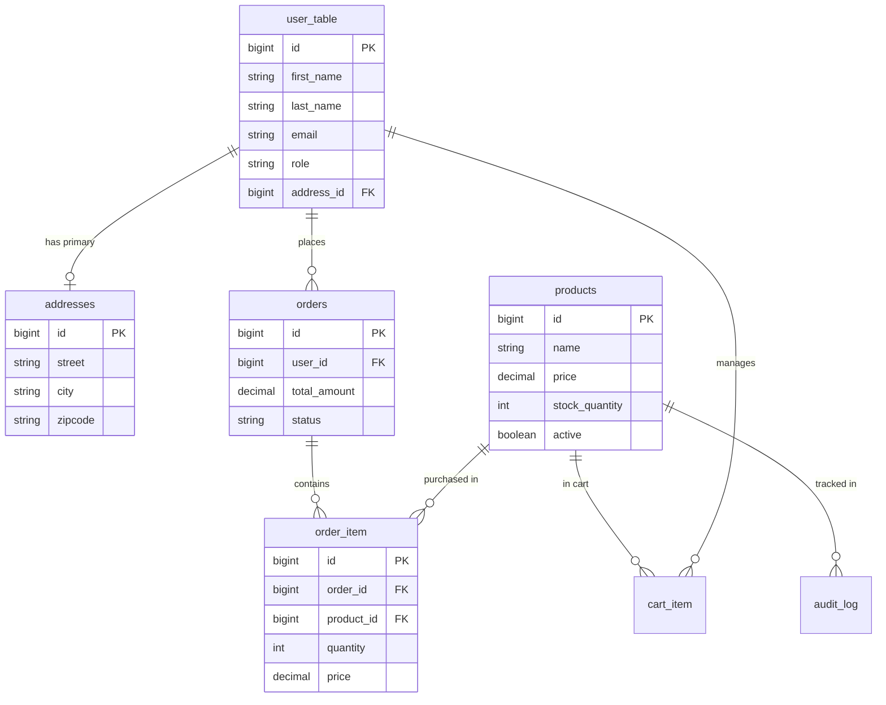

# Detailed Database Systems Project Report: Ecom-UI

## 1. Abstract
The Ecom-UI database is a robust, normalized relational schema designed for a high-performance e-commerce platform. It leverages **PostgreSQL** and incorporates advanced features such as **Triggers**, **Stored Procedures**, **Audit Logging**, and **Materialized Views** to ensure data integrity, atomicity, and efficient reporting. This report details the design decisions, normalization process, and procedural logic implemented to satisfy modern database standards.

---

## 2. Problem Statement & Objectives
The objective of this project is to develop a reliable and scalable backend for an e-commerce platform. Key challenges addressed include:
- **Concurrency & Data Consistency**: Ensuring stock levels are updated correctly during high-volume sales.
- **Data Integrity**: Preventing invalid orders and maintaining snapshots of historical prices.
- **Performance**: Optimizing frequent analytical requests (e.g., sales by category) using materialized views.

## 3. Methodology
The development followed a rigorous Database Life Cycle (DBLC):
1. **Requirements Analysis**: Identifying entities (User, Product, Order) and their attributes.
2. **ER Modeling**: Designing relationships and cardinalities.
3. **Normalization**: Applying 1NF, 2NF, and 3NF to eliminate anomalies.
4. **Implementation**: Writing DDL and DML scripts, followed by advanced PL/pgSQL procedural logic and triggers.

---

## 4. Database Architecture & ER Design

### 2.1 Entity Relationship Diagram (Mermaid)



### 2.2 Table Overview
The schema consists of 7 primary tables designed with strict referential integrity.

| Table | Description | Primary Key | Foreign Keys |
|---|---|---|---|
| `user_table` | Stores user profiles and roles. | `id` | `address_id` |
| `addresses` | Stores shipping/billing data. | `id` | - |
| `products` | Catalogue with stock and active status. | `id` | - |
| `cart_item` | Temporary state for user shopping carts. | `id` | `user_id`, `product_id` |
| `orders` | Records of completed transactions. | `id` | `user_id` |
| `order_item` | Line items for specific orders (snapshots). | `id` | `order_id`, `product_id` |
| `audit_log` | Security trail for tracking data changes. | `id` | - |

### 2.2 Relationship Cardinality
- **User 1:1 Address**: Each user can have one primary shipping address. This is separated to reduce redundancy if multiple users share an address (e.g., household accounts).
- **User 1:M Order**: A single user can place multiple orders over time.
- **Order 1:M OrderItem**: An order serves as a header for multiple line items.
- **Product 1:M OrderItem**: A product can appear in many different order records. We store a **price snapshot** in `order_item` to prevent historical price drift.

---

## 3. Normalization & Functional Dependencies

The database was designed following the incremental normalization process to eliminate redundancy and update anomalies.

### 3.1 First Normal Form (1NF)
**Goal**: Atomic values and unique rows.
- **Reasoning**: We ensured that fields like `phone` or `category` contain only a single value. Addresses are broken down into `street`, `city`, `state`, etc., instead of being a single multi-valued string.

### 3.2 Second Normal Form (2NF)
**Goal**: 1NF + No partial functional dependencies.
- **Reasoning**: In the `order_item` table, every non-key attribute (`quantity`, `price`) depends on the unique `id` of the line item. They do not depend only on part of a composite key (like just `product_id`), which ensures that changing a product's name doesn't affect existing order quantities.

### 3.3 Third Normal Form (3NF)
**Goal**: 2NF + No transitive dependencies.
- **Reasoning**: 
    - In `user_table`, all user details depend directly on `user_id`. 
    - The `address_id` acts as a reference to the `addresses` table. If we put `city` and `zipcode` inside `user_table`, we would have a transitive dependency (`user_id -> zipcode -> city`). By separating `addresses`, we reach 3NF.
- **Strategic De-normalization**: The `total_amount` in `orders` is technically a derived attribute. In a pure theoretical 3NF, it would be removed. However, we chose to keep it for **performance optimization** and manage its integrity via **Triggers** (see Section 4).

---

## 4. Advanced Database Features (PL/pgSQL)

We implemented procedural logic directly in the database to ensure business rules are enforced regardless of the application layer.

### 4.1 Automated Stock Control (Trigger)
- **Utility**: Prevents overselling.
- **Logic**: A `BEFORE INSERT` trigger on `order_item` checks the `products.stock_quantity`. If insufficient, it raises an exception and rolls back the transaction. If sufficient, it decrements the stock automatically.

### 4.2 Synchronization of Totals (Trigger)
- **Utility**: Ensures the "Header-Detail" consistency.
- **Logic**: An `AFTER` trigger on `order_item` recalculates the parent `order.total_amount` whenever a line item is added, changed, or removed. This removes the need for the Application to perform complex math on every query.

### 4.3 Transactional Checkout (Stored Procedure)
- **Utility**: Guaranteed Atomicity (All or Nothing).
- **Logic**: `process_checkout(user_id)` encapsulates the logic of:
    1. Validating the Cart.
    2. Creating the Order Header.
    3. Transitioning items from `cart_item` to `order_item`.
    4. Clearing the User's Cart.
- **Benefit**: Even if the server crashes mid-checkout, the database will handle the rollback or completion, preventing ghost orders or lost items.

---

## 5. Data Abstraction & Performance

### 5.1 Simple Views
The `view_inventory_value` provides a real-time "Asset Report" for administrators, calculating the monetary value of current stock without cluttering the physical table with derived data.

### 5.2 Materialized Views
The `mv_category_sales_stats` is used for executive reporting. Since calculating revenue per category across millions of rows is slow, a **Materialized View** persists the results on disk. It can be refreshed during off-peak hours using:
```sql
REFRESH MATERIALIZED VIEW mv_category_sales_stats;
```

---

## 6. SQL Query Mastery (Analytical Reporting)

To demonstrate advanced SQL capabilities, we use complex joins and window functions for business analytics.

### 6.1 Top 3 Customers by Spending
```sql
SELECT 
    u.first_name || ' ' || u.last_name AS customer_name,
    COUNT(o.id) AS order_count,
    SUM(o.total_amount) AS total_spent
FROM user_table u
JOIN orders o ON u.id = o.user_id
GROUP BY u.id
ORDER BY total_spent DESC
LIMIT 3;
```

### 6.2 Products That Have Never Been Sold
```sql
SELECT name, category, stock_quantity
FROM products
WHERE id NOT IN (SELECT DISTINCT product_id FROM order_item);
```

### 6.3 Highest Revenue Category
```sql
SELECT 
    category, 
    SUM(total_revenue) AS category_revenue
FROM mv_category_sales_stats
GROUP BY category
ORDER BY category_revenue DESC
LIMIT 1;
```

## 7. Conclusion
The Ecom-UI database demonstrates a sophisticated understanding of relational design. By moving critical business logic (stock, totals, audit) into the **Database Layer** using **PL/pgSQL**, we have created a system that is not only normalized to 3NF but also highly performant and secure against data inconsistencies.
