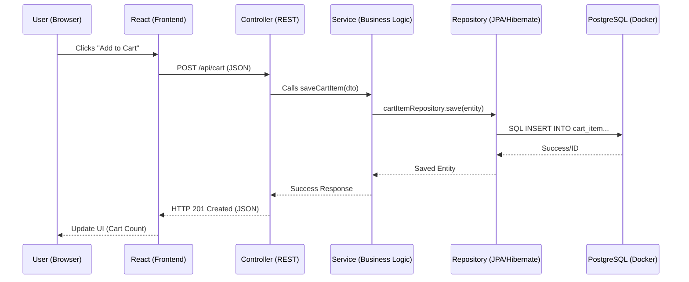

# Detailed Technical Architecture Guide: Ecom-UI

This document provides a deep dive into the internal mechanics of the Ecom-UI platform, explaining how Java, Spring Boot, JPA, and Docker collaborate to provide a seamless e-commerce experience.

---

## 1. Request Flow (The Journey of a Click)
When a user interacts with the UI, the data travels through several specialized layers.



---

## 2. Backend Architecture (Spring Boot Layers)

### 2.1 The "Starter" Ecosystem
The project uses **Spring Boot Starters**, which are pre-configured sets of dependencies:
-   **`spring-boot-starter-web`**: Provides the embedded **Tomcat** server and APIs for RESTful services.
-   **`spring-boot-starter-data-jpa`**: Brings in Hibernate and the JPA infrastructure.

### 2.2 Entity Mapping (@Entity)
The **Model** classes (e.g., `Product.java`) use JPA annotations to tell Hibernate how to map Java fields to Database columns:
```java
@Entity // Tells JPA this maps to a table
@Table(name = "products")
public class Product {
    @Id
    @GeneratedValue(strategy = GenerationType.IDENTITY)
    private Long id;
    
    private String name;
    private Double price;
}
```

---

## 3. The Magic of Spring Data JPA
The **Repository** layer is where most SQL generation happens implicitly.

### 3.1 Proxy Implementation
By extending `JpaRepository<Product, Long>`, Spring creates a **Proxy Object** at runtime. You don't need to write the implementation for `save()`, `findAll()`, or `findById()`; they are provided by default.

### 3.2 Method Name Queries
Hibernate can "infer" the SQL query from the method name in your Interface:
-   `findByCategory(String cat)` → `WHERE category = ?`
-   `findByNameContainingIgnoreCase(String name)` → `WHERE LOWER(name) LIKE LOWER(?)`
-   `deleteByActiveFalse()` → `DELETE FROM ... WHERE active = false`

---

## 4. API & JSON Serialization (Jackson)
Spring Boot automatically handles the conversion between Java Objects and JSON using a library called **Jackson**:
-   **Inbound**: When the frontend sends a POST request with JSON, Jackson maps those keys to the fields of a Java **DTO** (Data Transfer Object).
-   **Outbound**: When a controller returns a Java object, Jackson serializes it into a clean JSON format for the React frontend to consume.

---

## 5. Docker Networking Deep Dive

### 5.1 The Bridge Driver
Docker creates a virtual software bridge (switch) called `postgres` (from our compose file). 
-   Each container gets a virtual Ethernet interface (`veth`) connected to this switch.
-   **Isolations**: This network is isolated from your Windows host's main network, meaning external hackers can't see port 5432 unless we explicitly "bridge" it out (which we do via port 5433).

### 5.2 Internal DNS (Service Discovery)
Docker runs a lightweight DNS server. 
-   When `pgadmin_container` tries to connect to the hostname `postgres`, it asks the Docker DNS server.
-   The DNS server looks at the `docker-compose.yml`, identifies that the `postgres` service is at IP `172.18.0.2` (example), and returns it.
-   **Why this matters**: This makes your infrastructure "portable." You can rename containers or change IP subnets, and as long as the service name remains `postgres`, the apps will still find the database.

### 5.3 Volume Persistence
Data is not stored *inside* the container image (which is read-only). It is stored in a **Named Volume** (`postgres:/var/lib/postgresql/data`).
-   Even if the container is deleted (`docker rm`), the volume remains on your host's disk.
-   When a new container starts, it "mounts" this volume and has all its data back immediately.
